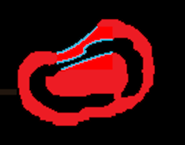
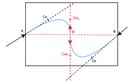
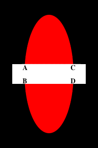
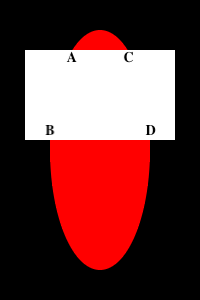
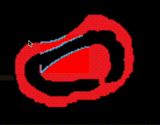

# Shape Completion by Curve Stitching

The ShapeCompletion project aims at recovering (completing) the **structure** of a shape after a portion of it is erased. In other words, given a shape with arbitrarily "discontinued parts", assuming that we have **no prior knowledge** about the shape, how can we **reasonably connect the endpoints** at the discontinuities?

A shape with a hole. There are 6 endpoints in this case.

Demo images will be used throughout this documentation. Black pixels denote the background (which is completely ignored). Red pixels denote the rasterized *shape*. White pixels denote the *hole*. The (imaginary) intersection of the shape and the hole is the aforementioned "discontinued parts", which is what we try to recover.

An example of completed shape.

Blue pixels will be used to denote the outline of the recovered parts of the shape.

The whole process of shape completion involves intrapolating the missing outline and then filling the pixels in the hole with appropriate colors.

# Simple Shape Completion

Let's begin the experiment with simple shapes, like an ellipse.

The first image is the ground truth (for reference only). The second image is the input to the ShapeCompletion pipeline.

## Path Preprocessing

The first stage of the pipeline is to obtain and process the paths (curves) representing the existing outline of the shape.

[Vision Cortex's library](https://github.com/visioncortex/visioncortex) provides the necessary utilities to extract raw paths from an image.

Yellow pixels denote the identified outline of the shape after simplification.

## Tail Tangent Approximation

The next step is to (divide, if needed, and) extract the two curves from the two endpoints; smoothing is performed to better approximate the tangents near the endpoints (*tails* of the whole curve). After this step, we will obtain two tangents (2-D direction vectors), one at each tail. We will call these tangents *tail tangents*.

The naive approach is to simply take A as the tail tangent, but better (more practical/useful) approximations may be obtained by taking more subsequent segments into account (e.g. B, C, D).

A number of factors determine the accuracy and robustness of tail tangent approximation. Our implementation supports configurations like how many points to consider from the tails, how long should the segments being considered accumulate to, and how the weights for each segment should change towards the tails.

## Intrapolation

    
Why "<i>Intra</i>polation"?

    

        If we considered the existing outline of the shape as separate curves at each endpoint, we would be doing <i><b>inter</b>polation</i> <b>between</b> curves. However, in this project, we are focusing on curves (existing + missing) that form an outline of a single shape, so we argue that we are doing <i><b>intra</b>polation</i> <b>within</b> a curve.
    

    

With the two endpoints and their corresponding tail tangents, we can calculate for the missing part in different scenarios. The type of curves used in this project is cubic [Bézier curves](https://en.wikipedia.org/wiki/B%C3%A9zier_curve). To specify such a curve, four points are required. An important property to note about this type of curves is that *the curve constructed is always fully contained in the quadrilateral defined by the four points*.

The first scenario is when the two tail tangents point to the same side with respect to the line connecting the two endpoints (we call this line the *base*).

Both tail tangents at A and B point to the same side of the red, dashed line (the base).

To construct the curve between A and B, we need to identify two *control points* (CA and CB) between them. In our approach, we started with what we think is intuitive and made tweaks to resolve some issues in practice; this is what we end up with:

First, find the intersection of the two lines starting at A and B along the corresponding tail tangent. The mid-points between A/B and the intersection are then set to be CA and CB. If the intersection is too far away (i.e. the two lines are close to, if not exactly, parallel), we simply use a point on each line as the control points (e.g. translate A/B along their tail tangent by a factor of base length). Either way, if either CA or CB end up lying outside the hole region, we *retract* it by pushing it towards the endpoint, until it reaches the hole region.

    
What if the intersection was in the other direction?

    
    

        If the line originating from A and B intersect in the negative direction (as shown above), we simply <i>correct</i> them by bending them inwards to be perpendicular with the base.
    

    

Another scenario is when the two tail tangents point to different sides of the base, as below.

 A simple dot product operation can be used to detect such a scenario.

In this case, any intersections detected are meaningless because they must lie outside the hole region. Instead, we divide the curve into two halves and intrapolate two subcurves from each endpoint to the mid-point of the base as shown above.

The last possible scenario is trivial to handle: when the lines are coincident, simply connect the endpoints with a straight line.

The case of our simple ellipse falls into the first scenario. The intrapolated outline is shown as follows:

## Color filling

To fill the hole with appropriate colors, we define three element types: *Blank*, *Structure*, and *Texture*. Note that in this project, it is restricted that only one shape is processed at once, and actual texture recovery is not performed - we're only interested in knowing which parts of the hole are Blank, Structure, or Texture.

Element     |Description
:-----------|:----------
Blank       |Background pixels. (Black in our demo)
Structure   |Outline of the shape; The intrapolated curve(s) obtained above is rasterized and drawn onto the hole. (Blue in our demo)
Texture     |Solid part of the shape; To be filled in this section. (Red in our demo)

The Structure elements divide the hole into several subregions. Each of these subregions contains wholly either Blank or Texture elements.

In our example, the hole is divided by the intrapolated curve into two subregions. In order to guess whether to fill the subregions with Blank or Texture elements, we take majority votes among the pixels around the hole.

For the bottom subregion, the pixels right outside the bottom boundary are mostly red (Texture), therefore this subregion is classified as Texture and filled with Texture elements.

For the top subregion, the pixels outside the left, top, and right sides of the boundary are considered. All of those pixels are background (Blank), so this subregion is classified as Blank.

After filling, the shape of the ellipse is completed, as follows:

If we move the hole around, shape completion yields the following results:

# Complex Shape Completion

The process of shape completion shown above has been rather straightforward because there is a strong assumption - the hole cuts the shape at exactly 2 endpoints only. Consider the following case:

At a glance, we can tell how the endpoints should be grouped - A with B, and C with D, but how can we model the problem to match the endpoints such that the result of color filling always makes sense?

## Endpoint Matching

### Failed attempt: Local Proximity

An intuitive approach might be by endpoint proximity in a greedy manner. If we simply connect each endpoint to its nearest neighbor, the correct matching is found for the above case. However, this approach ceases to work for the following case:

The correct matching seems to be A with B and C with D, but the top two endpoints are the closest.

### Avoiding Intersections

Problematic matchings are the ones that lead to intersecting curves. If intersection occurs, the resulting shape deforms and there may be subregions that are surrounded by others, leading to problems in color filling. Therefore, the key of endpoint matching lies in **avoiding intersections**.

Before intrapolation, some intersecting curves can already be identified by looking at endpoint connections that intersect.

Imagine we have 4 endpoints A, B, C, and D. If the line segment AB intersects with CD, then the curve intrapolated from A to B must intersect with that from C to D.

Therefore, the first step to avoiding intersecting curves is to filter out matchings that contain intersecting lines.

This [webpage](https://prase.cz/kalva/putnam/psoln/psol794.html) shows that minimizing the total length of endpoint connections is equivalent to finding a matching with no intersecting connections. Hence the problem is reduced to a [Euclidean Bipartite Matching Problem](https://core.ac.uk/download/pdf/82212931.pdf), i.e. optimizing the global weights over matchings. The [Hungarian algorithm](https://en.wikipedia.org/wiki/Hungarian_algorithm) is used to solve such a problem.

The rest of the intersecting curves have to be caught and filtered out after intrapolation has taken place. Bézier curve intersection can be detected by a recursive method called [De Casteljau's (Bézier Clipping) algorithm](https://en.wikipedia.org/wiki/De_Casteljau%27s_algorithm), which is implemented in [flo_curves](https://crates.io/crates/flo_curves), the Bézier curve library we use.

# Stability and Robustness

Throughout the process of development, we encountered many edge cases where the pipeline would break down when faced with certain geometrical configurations. For example, an endpoint detected at the corner of the hole may or may not be useful, because it may be an edge entering the hole at a corner, or it may just be the hole touching an edge with its corner.

As much as we hope to correctly handle every single situation (if it's possible in the first place), we figured, from an engineering perspective, that we want an effective way to secure maximum overall robustness with a reasonable amount of effort.

From experimentation, we observed that most of the pain-inducing geometrical configurations were deformed once we move the hole by just 1 pixel. Therefore, we decided that once the pipeline breaks down, it should try to **recover by expanding the hole by 1 pixel in each direction**. If it successfully produces something in one of these attempts, that result is used.

As shown above, the performance of our implementation is stable for the most part. Occasionally, the pipeline incorrectly handles the cases when tail tangents are (nearly) coincident to the hole boundaries.

Such errors are detected but not recovered from.
