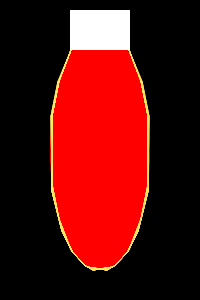
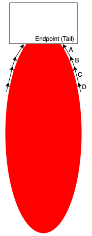
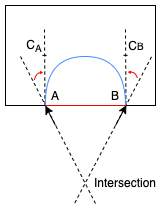

# Shape Completion by Curve Stitching

The ShapeCompletion project aims at recovering (completing) the **structure** of a shape after a portion of it is erased. In other words, given a shape with arbitrarily "discontinued parts", assuming that we have **no prior knowledge** about the shape, how can we **reasonably connect the endpoints** at the discontinuities?

A shape with a hole. There are 6 endpoints in this case.

Demo images will be used throughout this documentation. Black pixels denote the background (which is completely ignored). Red pixels denote the rasterized *shape*. White pixels denote the *hole*. The (imaginary) intersection of the shape and the hole is the aforementioned "discontinued parts", which is what we try to recover.

An example of completed shape.

Blue pixels will be used to denote the outline of the recovered parts of the shape.

The whole process of shape completion involves intrapolating the missing outline and then filling the pixels in the hole with appropriate colors.

## Simple Shape Completion

Let's begin the experiment with simple shapes, like an ellipse.

The first image is the ground truth (for reference only). The second image is the input to the ShapeCompletion pipeline.

### Path Preprocessing

The first stage of the pipeline is to obtain and process the paths (curves) representing the existing outline of the shape.

[Vision Cortex's library](https://github.com/visioncortex/visioncortex) provides the necessary utilities to extract raw paths from an image.

Yellow pixels denote the identified outline of the shape after simplification.

### Tail Tangent Approximation

The first step in the pipeline is to extract the two curves from the two endpoints; smoothing is performed to better approximate the tangents near the endpoints (*tails* of the whole curve). After this step, we will obtain two tangents (2-D direction vectors), one at each tail. We will call these tangents *tail tangents*.

After discrete rasterization, even a theoretically smooth curve will contain sharp corners. The naive approach is to simply take A as the tail tangent, but better (more practical/useful) approximations may be obtained by taking more subsequent segments into account (e.g. B,C,D).

A number of factors determine the accuracy and robustness of tail tangent approximation. Our implementation takes into account how many points to consider from the tails, how long should the segments being considered accumulate to, and how the weights for each segment should differ towards the tails.

### Intrapolation

    
Why "<i>Intra</i>polation"?

    

        If we considered the existing outline of the shape as separate curves at each endpoint, we would be doing *<b>inter</b>polation* **between** curves. However, in this project, we are focusing on curves that form an outline of a shape, so we argue that we are doing *<b>intra</b>polation* **within** curves.
    

    

With the two endpoints and their corresponding tail tangents, we can calculate the missing part in different scenarios. The type of curves used in this project is cubic [Bézier curves](https://en.wikipedia.org/wiki/B%C3%A9zier_curve). To specify such a curve, four points are required.

The first scenario is when the two tail tangents point to the same side with respect to the line connecting the two endpoints (we denote this line as the *base*).

Both tail tangents at A and B point to the same side of the red line (the base).

To construct the curve between A and B, we need to identify two *control points* (CA and CB) between them. In our approach, we started with what we think is intuitive and made tweaks to resolve practical issues; this is what we end up with:

First, find the intersection of the two lines starting at A and B along the corresponding tail tangent. CA and CB are then set to be the mid-point between A/B and the intersection. If the intersection is too far away (i.e. the two lines are close to parallel), we simply use a point on each of the lines as the control points (e.g. translate A/B along tail tangent by a factor of base length). Either way, if either CA or CB end up lying outside the hole region, we *retract* it by pushing it towards the endpoint, until it reaches the hole region.

    
What if the intersection is in the other direction?

    
    

        If the line originating at A and B intersect in the negative direction (as shown above), we simply *correct* them by bending them inwards to be perpendicular with the base.
    

The other scenario is when the two tail tangents point to different sides of the base, as below.

 A simple dot product operation can be used to detect such a scenario.

In this case, any intersections detected are meaningless. Instead, we divide the curve into two and intrapolate two subcurves from each endpoint to the mid-point of the base as shown above.

The final scenario is trivial to handle: when the lines are coincident, simply connect the endpoints.

The case of our simple ellipse falls into the first scenario. The intrapolated outline is shown as follows:

